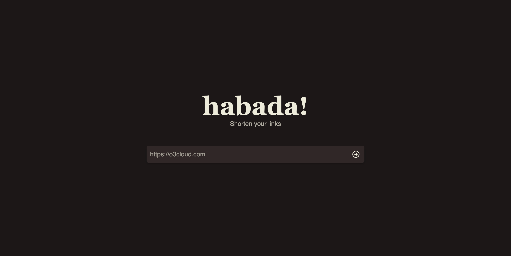

# habada
Url shortener



## How to run

### docker build
```shell
$ git clone https://github.com/chinaboard/habada.git
$ cd habada
$ make docker-build
```
### docker depoly
```shell
$ docker run -d \
	--name habada \
	-p 3333:3333 \
	-e MYSQL_USER=dbuser \
	-e MYSQL_PASSWORD=dbpassword \
	-e MYSQL_HOST=dbhost:dbport \
	-e MYSQL_DATABASE=dbname \
	habada:latest
```

visit http://localhost:3333, or http://host-ip:3333 (as appropriate).

